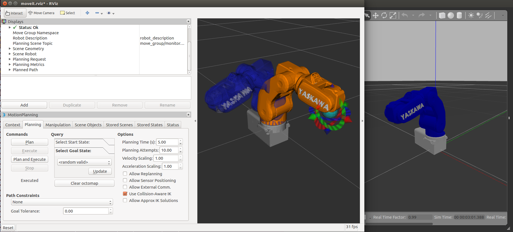

# motoman_motomini

Packages for simulating Motoman Motomini in Gazebo and RViz

Note: I clone motoman_motomini_support from ROS-Industrial [link](https://github.com/ros-industrial/motoman/tree/kinetic-devel/motoman_motomini_support),  and add Yaskawa logo on its forth joint (for demo purpose).

 
